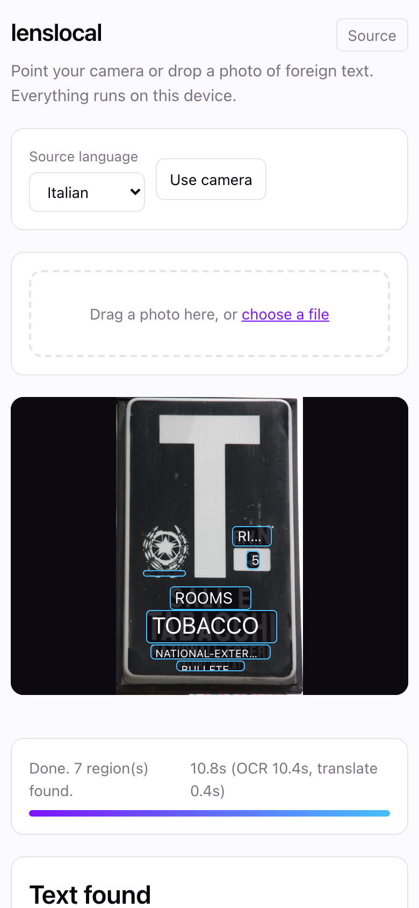
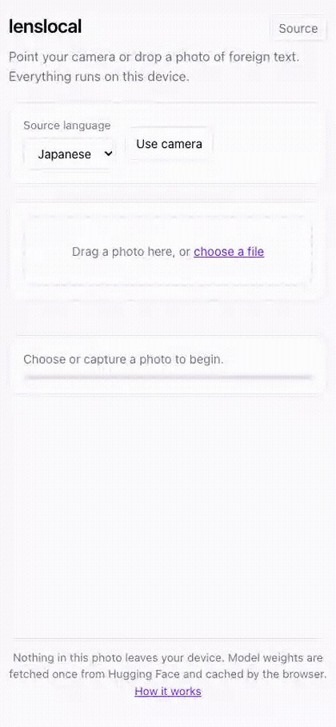

# lenslocal

**Live demo: https://arthur031221.github.io/lenslocal/**

Point your camera or drop a photo of foreign text and get a translated overlay, right in the browser. No install, no account, no server: OCR and translation both run on your device through [transformers.js](https://github.com/huggingface/transformers.js).

Median 14.6 seconds from photo to translated overlay, measured on 20 real photos of signs and menus in 8 languages.[^1] OCR dominates that time (median 13.9s) and translation is fast once its model is loaded (median 0.1s). Accuracy is the honest catch: hand-reviewed against the source photos, the pipeline was usable or partially usable on 10 of 20 photos, and split sharply by script: 9 of 12 Latin-script photos versus 1 of 8 Chinese, Japanese, Korean or Russian photos. Full breakdown and method in `eval/results.md`.

  





## Why

Google Lens does this well, but it is closed source, needs the Google app or Chrome, and sends your photo to Google's servers. Every open alternative on GitHub is a toy: the closest hit for "camera translate" is a handful of stars and no working demo. Meanwhile transformers.js and WebGPU got good enough in 2026 that a real OCR model and a real translation model can both run at usable speed on a laptop or phone GPU, entirely client side. lenslocal is that: point a camera or drop a photo, read the text, translate it, done, nothing uploaded anywhere.

## Install

Nothing to install. Open https://arthur031221.github.io/lenslocal/ in a WebGPU browser (Chrome, Edge, or Chrome on Android). Safari falls back to wasm, see Limits below.

## Quick start

1. Open the live demo.
2. Pick the language written on your photo (the source language: the app always translates into English).
3. Drop a photo, or tap "Use camera" and capture one.
4. Wait for the two model downloads on first use (progress bars show it), then for OCR and translation to run. Translated text appears as boxes over the original.

Every subsequent photo in the same session, and every subsequent visit once the browser has cached the model weights, skips the download.

## How it works

- `src/pipeline.ts` loads two models through transformers.js: `onnx-community/Florence-2-base-ft` running the `<OCR_WITH_REGION>` task for text detection plus recognition in one pass, and one `Xenova/opus-mt-<lang>-en` model per source language for translation. Both are ONNX models running on WebGPU when available, with an automatic fallback to the wasm execution provider (`src/pipeline.ts:detectDevice`) when `navigator.gpu` is missing or fails to produce an adapter, which is how Safari and older browsers are handled today.
- `src/merge.ts` is pure logic, no DOM, no model calls: it turns Florence-2's raw quad boxes and labels into axis-aligned regions, puts them in reading order (top row first, left to right), and merges regions that sit on the same line and close together (for example a menu item and its price) so the overlay shows one translated line instead of several overlapping fragments.
- `src/layout.ts` is also pure: it maps a region's bounding box from the original photo's pixel coordinates onto the on-screen `` element's rendered size, accounting for `object-fit: contain` letterboxing when the photo and the stage have different aspect ratios.
- `src/main.ts` is DOM wiring only: camera capture (`getUserMedia`, rear camera preferred), drag-and-drop and file picker, the language select, a progress bar driven by transformers.js's per-file download progress callbacks, and rendering the translated overlay boxes plus a plain-text results list underneath (useful on touch devices where hovering a box for the original text is not available).
- `public/sw.js` is a small service worker that caches the app shell (HTML, JS, CSS, icon) with a stale-while-revalidate strategy, so the page itself loads offline after the first visit. It deliberately ignores cross-origin requests: the model weight downloads from the Hugging Face CDN are cached by transformers.js itself through the Cache Storage API, and having two caching layers fight over the same range requests is worse than one.
- No analytics, no telemetry, no third-party scripts. The only network requests the app makes are to the Hugging Face CDN for model weights, once, cached after that.
- Deploys to GitHub Pages from `main` through `.github/workflows/pages.yml` (Vite `base` is `/lenslocal/`).

## Comparison

| Project | What it does | What it lacks for this use |
|---------|---------------|------------------------------|
| Google Lens / Google Translate camera mode | Best-in-class camera translation | Closed source, cloud pipeline, needs the Google app or account, photo leaves the device |
| Microsoft Translator / Naver Papago camera mode | Same category, different vendor | Same: closed source, cloud-based, mobile app only |
| Open-source "camera translate" repos on GitHub | A handful of small projects exist | The most-starred hit for this exact idea sits at roughly a dozen stars with no working hosted demo, per a GitHub search run for this project's research on 2026-09-30 |
| lenslocal | Runs OCR and translation client side through transformers.js, hosted as a static site, zero install | English is the only translation target for now (see Limits). Accuracy is well below Google Lens on dense or stylized text (see eval/) |

## Reference

```
npm install
npm run dev        vite dev server, http://localhost:5173/lenslocal/
npm test            vitest (tests/*.test.ts)
npm run lint         eslint
npm run build         typecheck and build to dist/
npm run preview       serve the production build locally
```

Feasibility check (confirms the OCR and translation models still load and run, with the WebGPU-vs-wasm device probe): `npm run dev` in one terminal, then `node feasibility/run.mjs` in another.

Eval harness (re-measures accuracy and timing against `eval/photos/`): `npm run dev` in one terminal, then `FEAS_URL=http://localhost:5173/lenslocal/eval.html node eval/run.mjs` in another. Writes `eval/results.json`.

## Limits and FAQ

**What languages are supported?** Eight source languages translate into English: Japanese, Chinese, French, Spanish, German, Italian, Korean, Russian (`src/languages.ts`). Translating into a language other than English, or adding a source language, means adding another `opus-mt` pair and is a small change, see `CONTRIBUTING.md`.

**Does it work on my phone?** Yes for Chrome on Android. iOS Safari does not expose WebGPU to web content as of this writing, so it falls back to the wasm execution provider, which is much slower for a 270 MB vision-language model. The camera and file drop UI both work at phone width either way.

**Is it accurate?** Unevenly, and it is worth knowing before you rely on it. Hand-reviewed against 20 real photos, the result was usable or partially usable on 10 of 20: 9 of 12 for Latin-script languages (French, Spanish, German, Italian), but only 1 of 8 for Chinese, Japanese, Korean or Russian, where the OCR step itself frequently misreads the characters or finds no text at all. The full per-photo breakdown, including the failure cases, is in `eval/results.md`. This reflects the small, quantized OCR model chosen so the app can run entirely client side, not a bug to file.

**Does live video translation exist?** No. This is photo in, overlay out, not a continuous camera feed. Running Florence-2 once per frame at video rate is not realistic on this hardware today.

**What happens to my photo?** Nothing leaves the device. There is no server component to this app at all, it is a static site. The only network traffic is the one-time model weight download from the Hugging Face CDN.

## Related projects

- [slopblock](https://github.com/Arthur031221/slopblock): Another on-device browser tool with the same no-network guarantee, feed filtering instead of camera translation.
- [snipmd](https://github.com/Arthur031221/snipmd): Local OCR on a desktop instead of a browser, the same idea of reading text off an image without uploading it.

## Contributing and license

See `CONTRIBUTING.md`. MIT, copyright 2026 Arthur.

[^1]: MacBook Air, Apple M5, 24 GB, macOS 26.6, Chrome for Testing 153.0.8010.12, WebGPU (Metal backend), 2026-09-30. 20 photos of real signs and menus in 8 languages, sourced from Wikimedia Commons (citations in `eval/CITATIONS.md`). Time is OCR inference plus translation inference per photo, excluding the one-time model download, `eval/run.mjs` against `eval/photos/`. Full table, accuracy method and results in `eval/results.md`.
